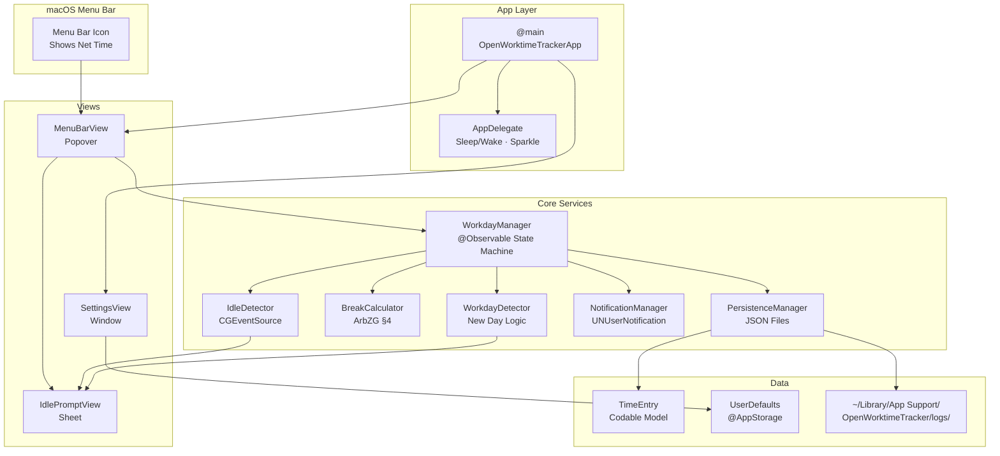
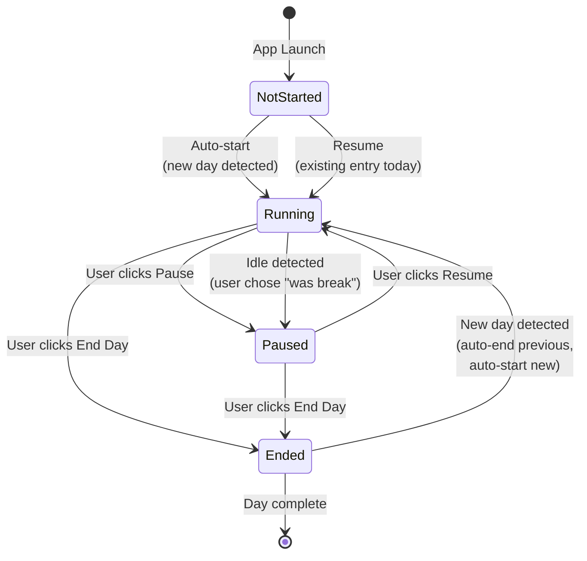
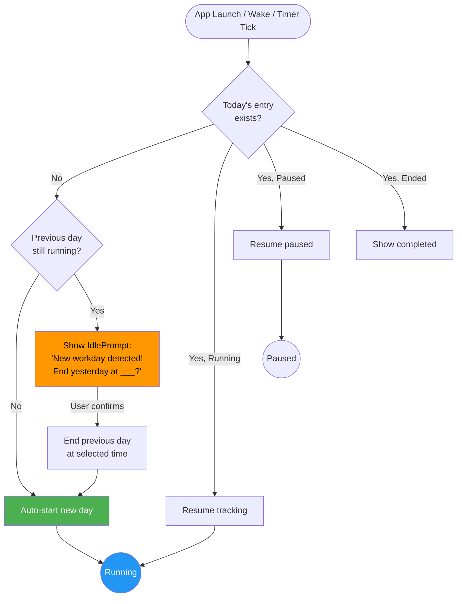
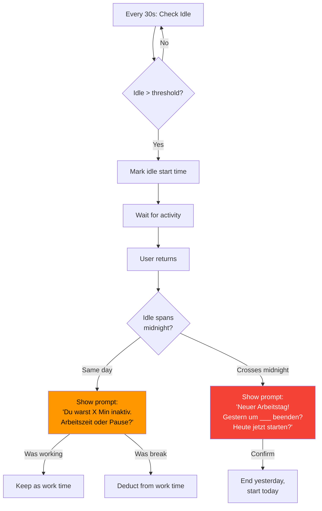
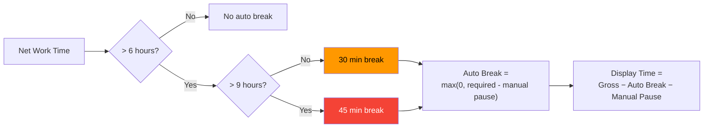
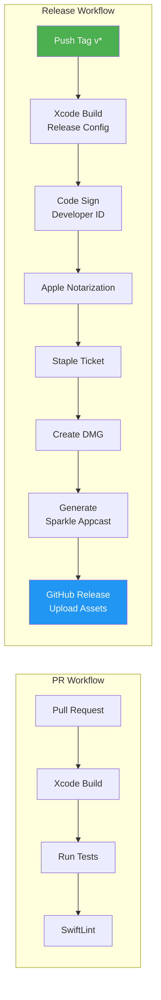

<p align="center">
  
  
  
  
  
</p>

# OpenWorktimeTracker

A native macOS menu bar app that **automatically tracks your daily working hours** — silently, smartly, and beautifully.

No Dock icon. No manual start. Just open your Mac and your workday begins.

## Features

- **Auto-Start** — Launches at login, starts tracking immediately
- **Smart Day Detection** — Detects new workdays automatically (overnight, sleep/wake, restart)
- **ArbZG-Compliant Breaks** — Automatic break calculation per German labor law (§4 ArbZG)
- **Threshold Notifications** — Alerts at configurable limits (e.g., 8h normal, 10h critical)
- **Idle Detection** — Detects inactivity and asks: "Was that a meeting or a break?"
- **Screen Lock Detection** — Recognizes lock/unlock as idle periods
- **Live Menu Bar** — Shows net work time, color-coded by threshold, animated while running
- **7-Day History + Stats** — Weekly bar chart and week/month summary with overtime tracking
- **Manual Time Editing** — Adjust start/end time directly in the popover
- **Global Shortcuts** — Ctrl+Option+P (pause/resume), Ctrl+Option+E (end day)
- **iCloud Sync** — Sync daily logs to iCloud Drive across devices
- **macOS Widgets** — Small and medium widgets showing current work time
- **Daily JSON Logs** — Transparent, exportable, one file per day
- **Sparkle Auto-Updates** — Seamless updates via GitHub Releases
- **Ethereal Design** — Glassmorphism, tonal depth, adaptive light/dark mode

---

## Architecture

### System Overview



### State Machine



### Workday Detection Flow



### Idle Detection Flow



### Break Calculation (ArbZG §4)



### CI/CD Pipeline



---

## Installation

### Download (Recommended)
1. Go to [Releases](../../releases)
2. Download `OpenWorktimeTracker.dmg`
3. Drag to Applications
4. Launch — it appears in your menu bar

The app auto-updates via Sparkle when new versions are available.

### Build from Source
```bash
# Prerequisites
brew install xcodegen swiftlint

# Clone & build
git clone https://github.com/64x-lunicorn/OpenWorktimeTracker.git
cd OpenWorktimeTracker
make build
```

---

## How It Works

1. **Open your Mac** → App starts automatically (Login Item)
2. **Work normally** → Timer runs in the menu bar showing your net time
3. **Take breaks** → Idle detection asks if inactive time was a break or meeting
4. **Get notified** → Alerts at your configured thresholds (e.g., 8h, 10h)
5. **Day ends** → Click "End Day" or let it auto-detect overnight
6. **Next morning** → New workday starts automatically

### Menu Bar States

| State | Display | Color |
|-------|---------|-------|
| Working < 8h | `07:41` | Default |
| Working > Orange threshold | `08:15` | Orange |
| Working > Red threshold | `09:45` | Red |
| Paused | `[paused] 07:41` | Default |
| Day ended | `[done] 08:15` | Default |

---

## Settings

| Setting | Default | Description |
|---------|---------|-------------|
| Orange Threshold | 8h | Menu bar turns orange |
| Red Threshold | 9.5h | Menu bar turns red |
| Break after >6h | 30 min | ArbZG auto-break |
| Break after >9h | 45 min | ArbZG auto-break |
| Normal Notification | 8h | "Regular hours reached" |
| Critical Notification | 9.83h | "Time to go!" |
| Milestone Notification | 10h | "Maximum reached!" |
| Idle Threshold | 5 min | Time before idle prompt |
| Launch at Login | On | Auto-start with macOS |
| iCloud Sync | Off | Sync logs to iCloud Drive |

### Keyboard Shortcuts

| Shortcut | Action |
|----------|--------|
| Ctrl+Option+P | Pause / Resume |
| Ctrl+Option+E | End Day |

---

## Data Storage

Daily logs stored as JSON in:
```
~/Library/Application Support/OpenWorktimeTracker/logs/2026-04-15.json
```

```json
{
  "id": "550e8400-e29b-41d4-a716-446655440000",
  "date": "2026-04-15",
  "startTime": "2026-04-15T08:03:00Z",
  "endTime": null,
  "status": "running",
  "manualPauseSeconds": 0,
  "idleDecisions": [
    {
      "idleStart": "2026-04-15T12:00:00Z",
      "idleEnd": "2026-04-15T12:15:00Z",
      "decision": "pause"
    }
  ],
  "notifiedThresholds": ["normal"],
  "note": ""
}
```

---

## Tech Stack

- **SwiftUI** + AppKit hybrid — `MenuBarExtra` for menu bar, native macOS feel
- **`@Observable`** — Modern Swift 5.9 state management (no ObservableObject)
- **`SMAppService`** — Native Login Item (no helper app needed)
- **`CGEventSource`** — Hardware-level idle detection
- **`UNUserNotificationCenter`** — Native macOS notifications
- **Sparkle 2** — EdDSA-signed auto-updates
- **XcodeGen** — Xcode project from YAML spec
- **GitHub Actions** — CI/CD with code signing & notarization

---

## Contributing

See [CONTRIBUTING.md](CONTRIBUTING.md) for development setup and guidelines.

## License

[AGPL-3.0](LICENSE) — Free to use, modify, and distribute. Any modified version must also be open source under the same license.
