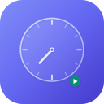
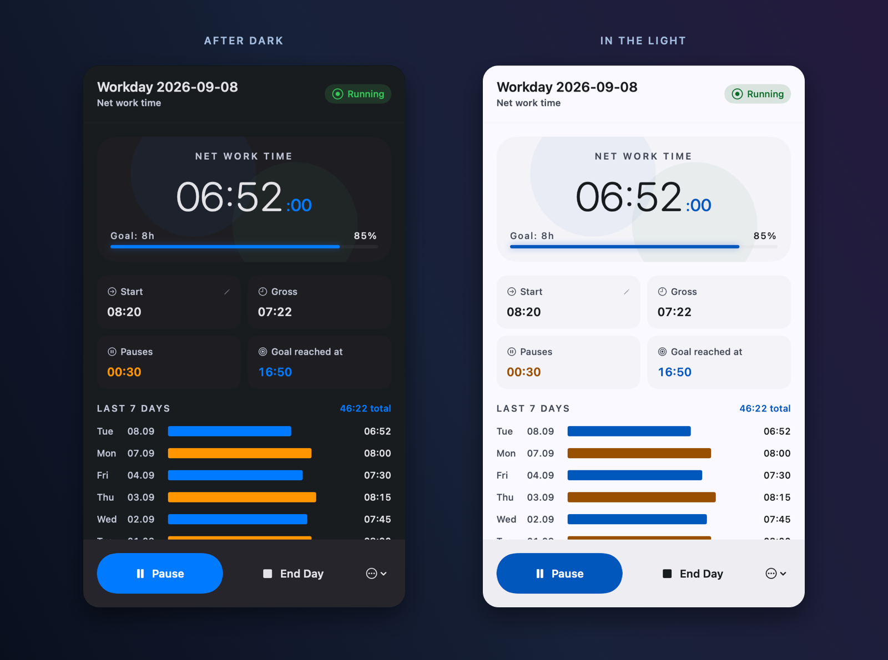
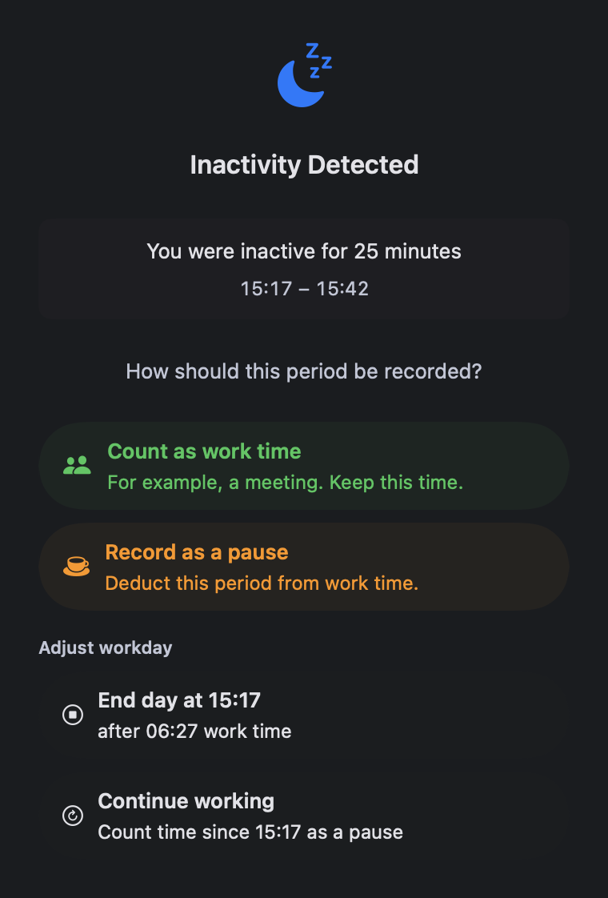
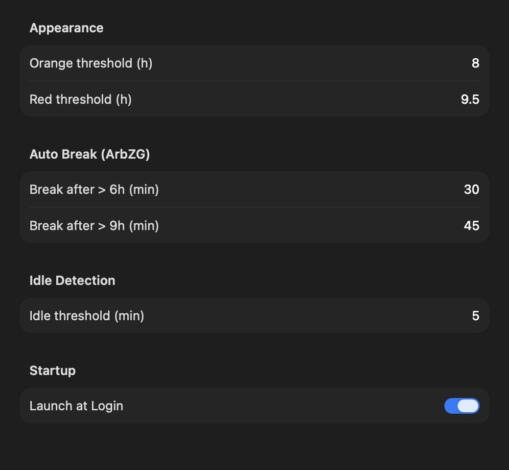

<p align="center">
  
</p>

<h1 align="center">OpenWorktimeTracker</h1>

<p align="center">
  <strong>Your workday, at a glance. Not another thing to manage.</strong><br>
  Automatic time tracking for your Mac. Native, local-first, and quietly out of your way.
</p>

<p align="center">
  <a href="https://github.com/64x-lunicorn/OpenWorktimeTracker/releases/latest"></a>
  
  <a href="https://github.com/64x-lunicorn/OpenWorktimeTracker/actions/workflows/build.yml"></a>
  <a href="LICENSE"></a>
</p>

<p align="center">
  <a href="https://github.com/64x-lunicorn/OpenWorktimeTracker/releases/latest"><strong>Download for macOS</strong></a>
  &nbsp; · &nbsp;
  <a href="https://64x-lunicorn.github.io/OpenWorktimeTracker/">Documentation</a>
  &nbsp; · &nbsp;
  <a href="CHANGELOG.md">What's new</a>
  &nbsp; · &nbsp;
  <a href="https://github.com/64x-lunicorn/OpenWorktimeTracker/issues">Feedback & ideas</a>
</p>

<p align="center">
  <a href="docs/public/screenshots/app-overview.png">
    
  </a>
</p>

<p align="center">
  <sub>Real app views, rendered with sample workdays. Screenshots show the current main branch; the latest release may look different.<br>
  Full-size screenshots: <a href="docs/public/screenshots/dashboard-dark.png">Dark mode</a> · <a href="docs/public/screenshots/dashboard-light.png">Light mode</a></sub>
</p>

## Less clock-watching. More living.

You opened your Mac, answered a few messages, joined a meeting, and took a coffee break.
But when did you actually start? And how much have you worked?

**OpenWorktimeTracker keeps the answer in your menu bar.** It tracks your day automatically,
accounts for pauses, and lets you know when you've reached your limits.
No account to create. No browser tab to keep open. No Dock icon competing for attention.

| Made for your day | What you get |
| --- | --- |
| **Start working, not a stopwatch** | Launch at login and automatic workday detection across sleep, wake, and restarts. |
| **Know when you're done** | Net work time, progress toward your daily goal, and an estimated finish time in one compact dashboard. |
| **Meetings count, too** | After inactivity, choose whether the time was work or a pause. No guessing on your behalf. |
| **Keep an eye on overtime** | Configurable orange/red menu-bar thresholds, notifications, recent workdays, and week/month summaries. |
| **Make it yours** | Adjust times, add daily notes, customize thresholds, and switch naturally between light and dark mode. |
| **Keep your data yours** | Local JSON logs, CSV export, a configurable storage folder, and optional iCloud Drive sync. |

Also included: **desktop widgets**, **pause/resume shortcuts**, **English and German**, and **Sparkle auto-updates**.

## A small app that understands a workday

### Away from the keyboard doesn't always mean away from work

A call, a whiteboard session, or a coffee break can all look like inactivity to a computer.
When you return, you decide how that time should count.

<p align="center">
  <a href="docs/public/screenshots/idle-decision.png">
    
  </a>
</p>

### Your thresholds. Your pace.

Choose when the menu-bar timer changes color, how long inactivity takes to trigger a prompt,
and when notifications should nudge you. Color thresholds and notification thresholds are independent.

<p align="center">
  <a href="docs/public/screenshots/settings.png">
    
  </a>
</p>

**Break-aware by default.** The default calculation follows the 30/45-minute break thresholds
in Germany's §4 ArbZG: more than 6 hours of work requires 30 minutes, more than 9 requires 45.
Pauses you've already recorded reduce any additional automatic deduction.

> Automatic deductions are bookkeeping, not a substitute for actually taking a break or a guarantee of legal compliance.
> [How break calculations work →](https://64x-lunicorn.github.io/OpenWorktimeTracker/features/breaks/)

## Get started in a minute

**Requires macOS 14 Sonoma or later.**

1. **[Download the latest release](https://github.com/64x-lunicorn/OpenWorktimeTracker/releases/latest)** and open its `.dmg`.
2. **Drag OpenWorktimeTracker to Applications** and launch it.
3. **Look in your menu bar**, not the Dock. Click the timer to see your day.
4. Allow notifications if you'd like reminders, and adjust your preferences under **… → Settings**.

That's it. With **Launch at Login** enabled, it's ready the next time you sign in.
Future releases arrive through the built-in Sparkle updater.

### Your everyday controls

| Want to… | Do this |
| --- | --- |
| Take a break | Click **Pause**; click **Resume** when you're back. |
| Finish for today | Click **End Day**. Your completed total stays fixed. |
| Correct a time | Use the pencil beside the start/end time, or open **… → Edit Log**. |
| Take your data with you | Choose **… → Export CSV** or open your log folder. |
| Open preferences | Choose **… → Settings**, or press `⌘ ,` while the app is active. |

Global shortcuts: `Ctrl + Option + P` to pause/resume, `Ctrl + Option + E` to end the day.
macOS may require Accessibility permission for global keyboard monitoring.

## Local first. Open by design.

Your daily logs are ordinary JSON files, not records locked inside a proprietary service.
By default, they're stored here:

```text
~/Library/Application Support/OpenWorktimeTracker/logs/
├── 2026-09-07.json
└── 2026-09-08.json
```

- **No account or hosted tracking backend is required.**
- **CSV export** makes it easy to use your hours elsewhere.
- **iCloud Drive sync is optional** and off by default.
- **You can inspect, back up, or move your logs** using normal files and folders.

Auto-update checks use Sparkle/GitHub; enabling iCloud sync uses Apple's iCloud Drive.
Local-first doesn't mean the app never connects to the network.

## Native all the way down

Built with **SwiftUI + AppKit**, not a web app inside a desktop window.
An AppKit lifecycle owns the native menu-bar item and popover; SwiftUI renders the dashboard and settings.
The tracking model uses `@Observable`, and persistence stays intentionally simple.

| Part | Built with |
| --- | --- |
| Interface | SwiftUI, AppKit, adaptive design tokens |
| Workday logic | Swift models, explicit state transitions, injectable clock and log store |
| macOS integration | Login items, idle detection, notifications, WidgetKit |
| Storage & updates | Daily JSON files, optional iCloud Drive, Sparkle 2 |
| Development | XcodeGen, XCTest, SwiftLint, GitHub Actions |

Curious about the internals? Start with the [architecture docs](https://64x-lunicorn.github.io/OpenWorktimeTracker/architecture/overview/)
and the [domain vocabulary](CONTEXT.md).

<details>
<summary><strong>Build it yourself</strong></summary>

You'll need macOS, Xcode 16 or later, and XcodeGen. SwiftLint is used for linting.

```bash
brew install xcodegen swiftlint
git clone https://github.com/64x-lunicorn/OpenWorktimeTracker.git
cd OpenWorktimeTracker
make generate
open OpenWorktimeTracker.xcodeproj
```

Select your signing team in Xcode before running the app. For a local ad-hoc build without
a provisioning profile, use the included **Build OpenWorktimeTracker (Debug)** task in VS Code.
Release signing is kept separate.

```bash
make test    # Run the XCTest suite with your signing setup
make lint    # Check Swift style
make build   # Build the Release configuration with your signing setup
```

More details: [Contributing](CONTRIBUTING.md) · [Build guide](https://64x-lunicorn.github.io/OpenWorktimeTracker/development/build/)

</details>

## Help make workdays a little better

Found a rough edge? Have an idea that would make this fit your day?
**[Open an issue](https://github.com/64x-lunicorn/OpenWorktimeTracker/issues)** — bug reports, UI feedback,
and small improvements are welcome.

Want to contribute code? See the [contribution guide](CONTRIBUTING.md).
If the app is useful to you, a GitHub star helps other Mac users discover it.

---

<p align="center">
  <strong>Less admin. A clearer workday.</strong><br>
  Free and open source under <a href="LICENSE">GPL-3.0</a>.
</p>
