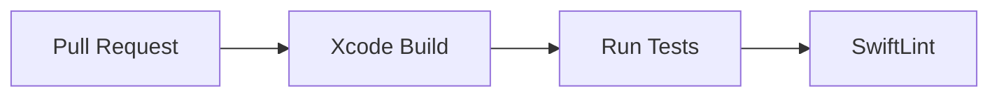
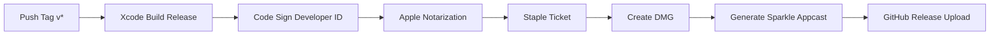

## Overview

OpenWorktimeTracker uses GitHub Actions for continuous integration and release automation. There are two workflows:

## PR Workflow (`build.yml`)

Triggered on every pull request to `main`:



### Steps

1. **Checkout** repository
2. **Generate** Xcode project with XcodeGen
3. **Build** in Release configuration
4. **Test** all unit tests (BreakCalculator, WorkdayDetector, PersistenceManager, TimeEntry)
5. **Lint** with SwiftLint

## Release Workflow (`release.yml`)

Triggered when a version tag (`v*`) is pushed:



### Steps

1. **Build** in Release configuration
2. **Code Sign** with Developer ID certificate (from secrets)
3. **Notarize** via Apple's notarization service
4. **Staple** the notarization ticket to the app
5. **Create DMG** using the `scripts/create-dmg.sh` script
6. **Generate Appcast** with Sparkle's `generate_appcast` tool
7. **Upload** DMG and appcast to GitHub Releases
8. **Publish** appcast to GitHub Pages

## Required Secrets

These GitHub repository secrets must be configured for the release workflow:

| Secret | Description |
|--------|-------------|
| `DEVELOPER_ID_CERTIFICATE_P12` | Base64-encoded Developer ID .p12 certificate |
| `CERTIFICATE_PASSWORD` | Password for the .p12 certificate |
| `APPLE_ID` | Apple ID email for notarization |
| `APPLE_TEAM_ID` | Team ID from Apple Developer Portal |
| `NOTARIZATION_PASSWORD` | App-specific password for notarization |
| `SPARKLE_PRIVATE_KEY` | EdDSA private key for Sparkle appcast signing |

## Creating a Release

```bash
# Tag the version
git tag v0.1.0
git push --tags
```

The release workflow will automatically:
1. Build, sign, and notarize the app
2. Create a DMG
3. Create a GitHub Release with the DMG attached
4. Update the Sparkle appcast on GitHub Pages

## Local Build

For local development, you do not need code signing or notarization:

```bash
make build    # Build release (unsigned)
make test     # Run tests
make lint     # Run SwiftLint
```
