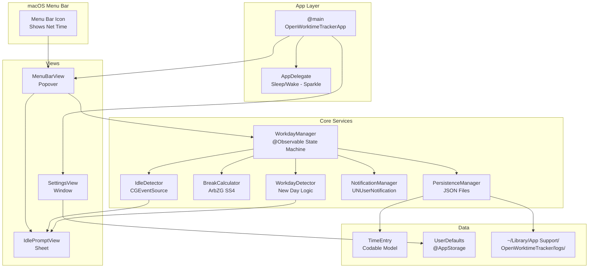

## Component Diagram



## Project Structure

```
OpenWorktimeTracker/
├── App/
│   ├── OpenWorktimeTrackerApp.swift   -- @main entry point
│   └── AppDelegate.swift              -- Sleep/wake, Sparkle, Login Item
├── Core/
│   ├── Models/
│   │   ├── TimeEntry.swift            -- Daily work entry (Codable)
│   │   └── AppSettings.swift          -- Settings constants
│   └── Services/
│       ├── WorkdayManager.swift       -- Central state machine (@Observable)
│       ├── WorkdayDetector.swift       -- New-day detection logic
│       ├── BreakCalculator.swift       -- ArbZG SS4 break calculation
│       ├── IdleDetector.swift          -- CGEventSource idle detection
│       ├── NotificationManager.swift   -- UNUserNotification management
│       └── PersistenceManager.swift    -- JSON file I/O, CSV export
├── Views/
│   ├── MenuBarView.swift              -- Main popover UI
│   ├── SettingsView.swift             -- Settings window (3 tabs)
│   ├── IdlePromptView.swift           -- Idle/new-day prompt dialog
│   ├── TimerDisplayView.swift         -- Large timer display
│   ├── MetricCardsView.swift          -- Metric cards grid
│   └── Components/
│       ├── ActionButton.swift         -- Themed action button
│       ├── GlassContainer.swift       -- Glassmorphism container
│       └── ProgressBarView.swift      -- Animated progress bar
├── Design/
│   └── DesignTokens.swift             -- Colors, typography, spacing
├── Resources/
│   ├── Info.plist                     -- App configuration
│   ├── OpenWorktimeTracker.entitlements
│   └── Assets.xcassets/               -- App icon, colors
└── Utilities/
    └── Date+Extensions.swift          -- Date formatting helpers
```

## Key Components

### WorkdayManager

The central `@Observable` state machine that orchestrates all other services:

- Manages the current `TimeEntry`
- Runs a 1-second timer for live updates
- Auto-saves every 30 seconds
- Coordinates idle detection, breaks, notifications, and persistence
- Handles sleep/wake events from AppDelegate

### WorkdayDetector

Stateless evaluator that determines what to do at app launch, wake, or date change. Returns one of four actions rather than performing side effects directly.

### BreakCalculator

Pure function that calculates required and auto breaks. No state, no side effects. Thoroughly unit-tested.

### PersistenceManager

Handles JSON file I/O with security-scoped bookmarks for custom directories. Uses ISO 8601 date encoding.

## Dependency Flow

Dependencies flow **downward**:

1. `OpenWorktimeTrackerApp` creates `WorkdayManager`
2. `WorkdayManager` owns instances of all services
3. Views receive `WorkdayManager` via `@Environment`
4. Services are stateless utilities (except `IdleDetector` which has a timer)

No singletons. No global state. No dependency injection framework.
