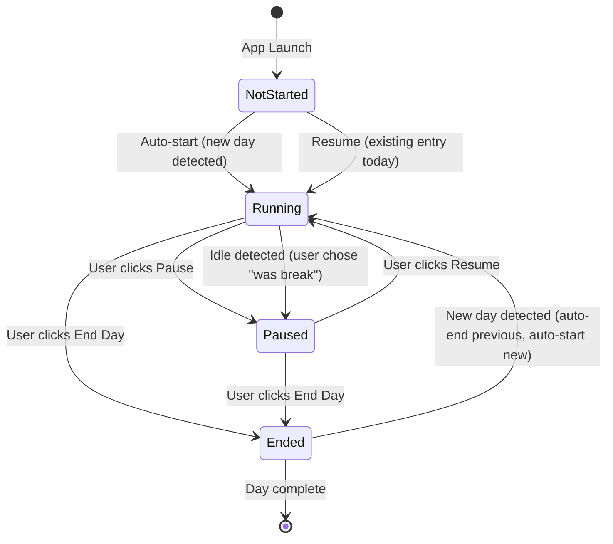
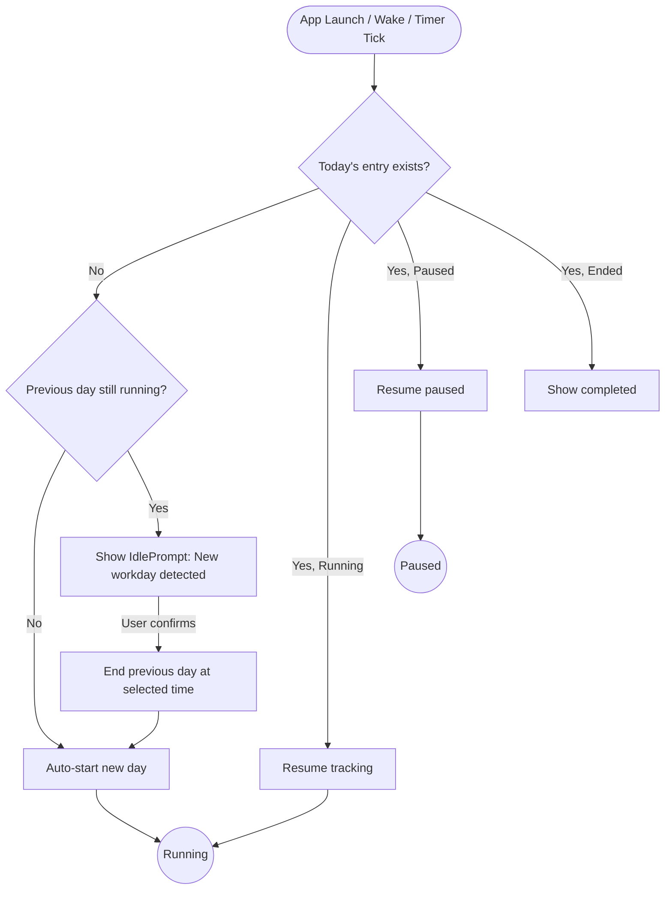

## States

The `WorkdayManager` operates as a state machine with four states:

| State | Description |
|-------|-------------|
| `notStarted` | App launched, no active workday |
| `running` | Timer is active, tracking work time |
| `paused` | Timer is paused (manual pause) |
| `ended` | Workday is finished |

## State Diagram

## Transitions

### notStarted -> running

Triggered by:
- App launch when no existing entry for today (auto-start)
- App launch when today's entry exists in `.running` or `.paused` state (resume)

### running -> paused

Triggered by:
- User clicks "Pause" in the popover
- Idle detection: user returns and classifies idle time as "break" (deducts time, stays running -- but the time is removed)

### running -> ended

Triggered by:
- User clicks "End Day" in the popover
- Automatic end when a new day is detected (previous day is ended, new day starts)

### paused -> running

Triggered by:
- User clicks "Resume" in the popover

### paused -> ended

Triggered by:
- User clicks "End Day" while paused

### ended -> running (new day)

Triggered by:
- New day detected by `WorkdayDetector`
- Previous day auto-ended at a reasonable time
- New day starts with a fresh `TimeEntry`

## Workday Detection Flow

## Timer Mechanics

When in `.running` state:

- A `Timer` fires every **1 second** to update the display
- The timer calculates `grossTime` as the difference between `startTime` and `now`
- `BreakCalculator` computes auto-breaks from the gross time
- `netWorkTime = grossTime - autoBreak - manualPauses`
- Threshold checks run on each tick
- Auto-save occurs every **30 seconds**
